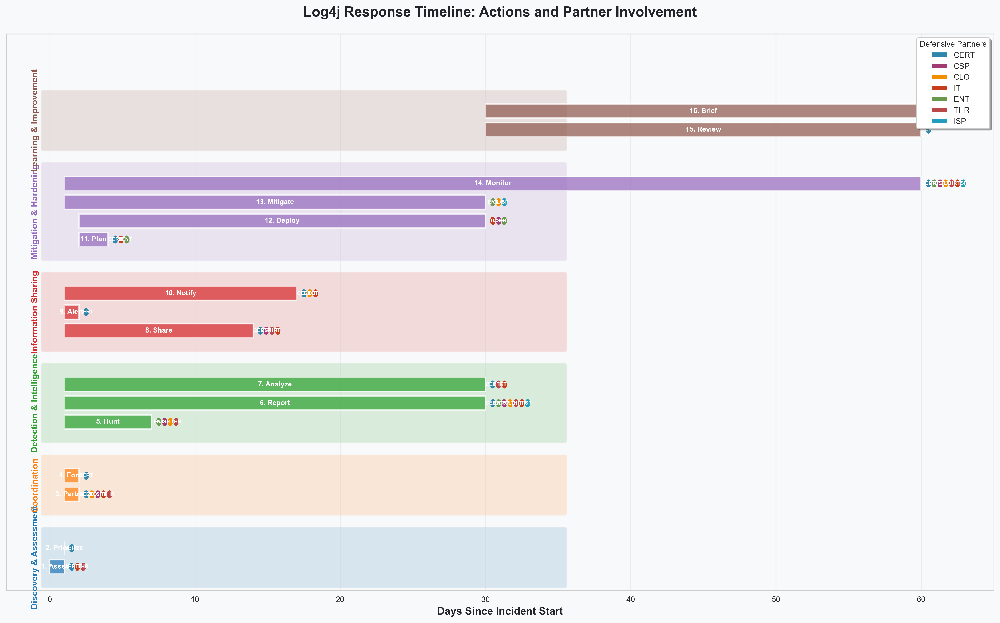
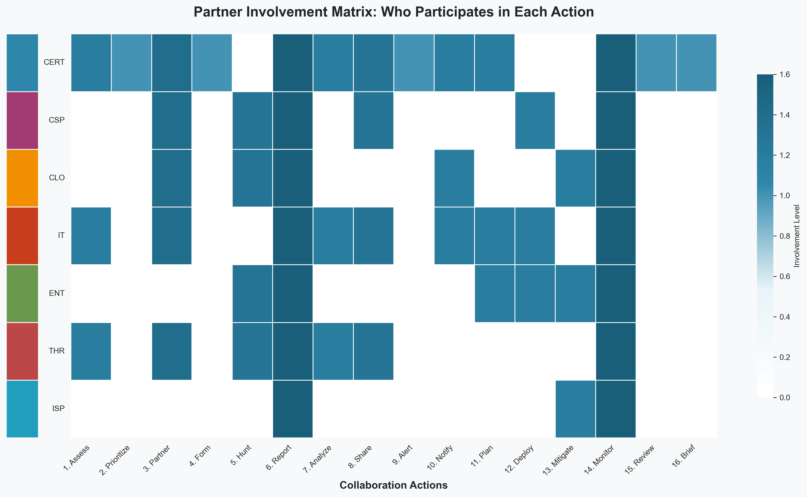
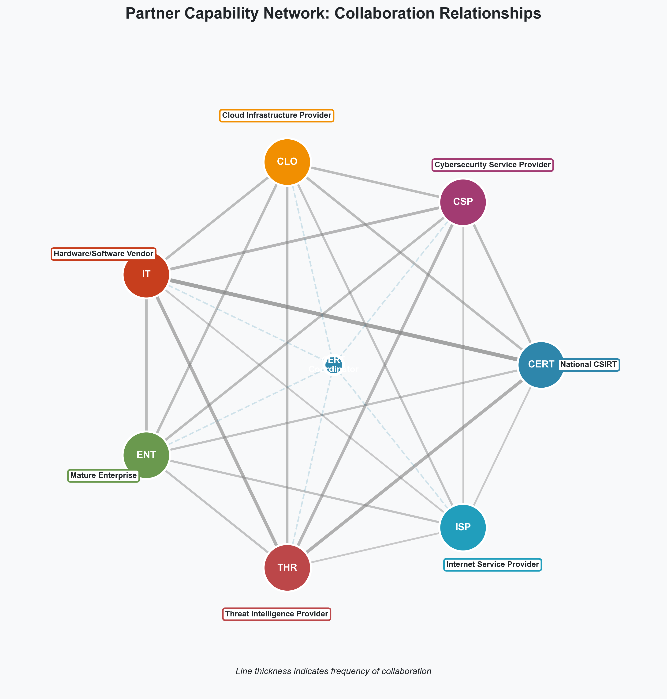
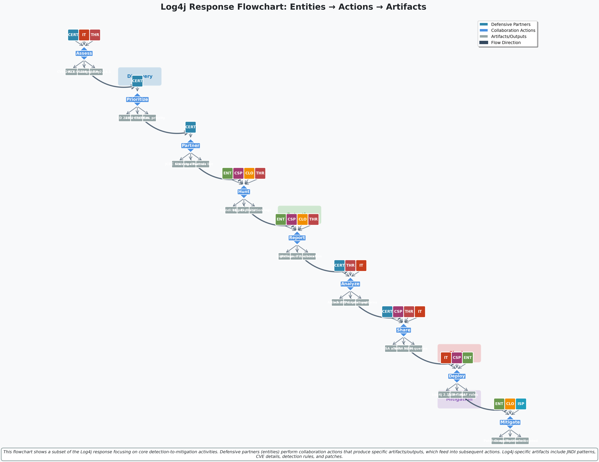

# Annotated Playbook: Log4j Critical Vulnerability Response (CVE-2021-44228)

**Real-World Example Mapped to UNITE Framework**

---

## Incident Overview

**Campaign Name:** Log4Shell (CVE-2021-44228)  
**Date:** December 2021  
**Threat Type:** Critical Remote Code Execution Vulnerability  
**Coordinator:** CISA JCDC (Joint Cyber Defense Collaborative)  
**UNITE Version:** v0.3

**Why This Example:**
The Log4j response demonstrated exceptional multi-partner collaboration. Within hours of disclosure, dozens of organizations across industry, government, and infrastructure providers coordinated detection, assessment, and mitigation. This playbook shows how UNITE's defensive partners and collaborative actions worked together in practice.

**Source Materials:**
- [CISA Emergency Directive 22-02](https://www.cisa.gov/news-events/directives/ed-22-02)
- [CISA Apache Log4j Vulnerability Guidance](https://www.cisa.gov/known-exploited-vulnerabilities-catalog)
- [Apache Log4j Security Advisories](https://logging.apache.org/log4j/2.x/security.html)
- [JCDC Log4j Response Summary](https://www.cisa.gov/news-events/news/joint-cyber-defense-collaborative-jcdc-announces-log4j-vulnerability-repository)

---

## Playbook Structure

### Defensive Partners Involved

This response engaged multiple UNITE partner types:

| Partner Type | Abbreviation | Role in Log4j Response | Why This Partner? |
|--------------|--------------|-------------------------|-------------------|
| **National CSIRT** | CERT | CISA coordinated the response, published advisories, and facilitated information sharing | **CERT** partners have visibility across government networks, can coordinate multi-organization response, and have authority to direct defensive actions |
| **Cybersecurity Service Provider** | CSP | Major security vendors (CrowdStrike, Mandiant, Palo Alto Networks) provided detection rules, threat intelligence, and hunting capabilities | **CSP** partners have broad customer visibility, can quickly develop and deploy detection signatures across many organizations |
| **Cloud Infrastructure Provider** | CLO | AWS, Azure, Google Cloud scanned customer environments and provided guidance on affected services | **CLO** partners have visibility into adversary infrastructure and can monitor customer environments at scale |
| **Hardware/Software Vendor** | IT | Apache Software Foundation (maintainer), plus vendors like IBM, Oracle, VMware, Red Hat who bundle Log4j | **IT** partners own the affected software and can provide patches, detection guidance, and deployment resources |
| **Mature Enterprise** | ENT | Large organizations with security teams actively hunted for exploitation and shared findings | **ENT** partners are likely targets and can provide real-time detection data and new IOCs as they're discovered |
| **Threat Intelligence Provider** | THR | Commercial and government threat intel providers shared exploitation patterns and attacker TTPs | **THR** partners have malware analysis capabilities and can provide context on attacker behavior |
| **Internet Service Provider** | ISP | Some ISPs monitored for exploitation traffic patterns | **ISP** partners have netflow data and can detect exploitation attempts at scale |

---

## Visualizations

### Timeline: Actions and Partner Involvement


*Timeline showing all 16 collaboration actions across 6 phases, with partner involvement indicators. Color-coded by phase: Discovery (Blue), Coordination (Orange), Detection (Green), Information Sharing (Red), Mitigation (Purple), Learning (Brown).*

### Partner Involvement Matrix


*Heatmap showing which defensive partners participate in each collaboration action. Darker colors indicate higher involvement levels. Partner types are color-coded on the left margin.*

### Partner Capability Network


*Network diagram showing collaboration relationships between partner types. Line thickness indicates frequency of collaboration. CERT (coordinator) is at the center, with connections to all partners.*

### Flowchart: Entities → Actions → Artifacts


*Flowchart showing a subset of the Log4j response focusing on core detection-to-mitigation activities. Defensive partners (entities) perform collaboration actions that produce Log4j-specific artifacts/outputs (CVE details, JNDI patterns, detection rules, patches), which feed into subsequent actions. Shows the flow from discovery through mitigation.*

---

## Collaboration Actions Timeline

### Phase 1: Discovery & Initial Assessment (Day 0-1)

#### Action 1: **Assess** (Technique ID: 00008)
**Sequence:** 1  
**When:** December 9-10, 2021  
**Who:** CERT (CISA), IT (Apache Software Foundation), THR (Multiple providers)

**What Happened:**
- Apache Software Foundation disclosed CVE-2021-44228
- CISA immediately assessed the vulnerability's impact on federal systems
- Threat intelligence providers analyzed exploitation attempts in the wild

**UNITE Mapping:**
```
"type": "assess",
"sequence": 1,
"description": "CISA and Apache assess the critical severity of Log4j vulnerability. 
Threat intelligence providers analyze real-world exploitation patterns to determine 
immediate threat level. Assessment determines this affects millions of applications 
globally and is actively being exploited.",
"output": [
    "Severity assessment: CRITICAL",
    "Impact scope: Millions of Java applications",
    "Exploitation status: Active in the wild",
    "Affected versions: Log4j 2.0-beta9 to 2.14.1"
]
```

**Why This Matters:**
The **Assess** action is critical first step. Without understanding scope and severity, partners can't prioritize effectively. In Log4j, the rapid assessment enabled coordinated response across all partners.

**Key Lesson:** Early assessment by multiple partner types (CERT + IT + THR) provides different perspectives that lead to better decisions.

---

#### Action 2: **Prioritize** (Technique ID: 00006)
**Sequence:** 2  
**When:** December 10, 2021  
**Who:** CERT (CISA)

**What Happened:**
- CISA issued Emergency Directive 22-02 requiring federal agencies to patch immediately
- CISA published guidance prioritizing detection and patching
- JCDC established Log4j as top priority for coordinated defense

**UNITE Mapping:**
```
"type": "prioritize",
"sequence": 2,
"description": "CISA prioritizes Log4j as highest-priority vulnerability requiring 
immediate coordinated response. Federal agencies directed to patch within 48 hours. 
Private sector urged to prioritize patching and detection.",
"output": [
    "Priority level: CRITICAL",
    "Response timeline: 48 hours for federal",
    "Focus areas: Detection, patching, threat hunting"
]
```

**Why This Matters:**
**Prioritize** gives all partners clear direction. Without this, organizations would have responded at different speeds, reducing collective defense effectiveness.

---

### Phase 2: Coordination & Partner Engagement (Day 1-2)

#### Action 3: **Partner** (Technique ID: 00007)
**Sequence:** 3  
**When:** December 10-11, 2021  
**Who:** CERT (CISA JCDC)

**What Happened:**
- JCDC activated cloud providers, security vendors, and software vendors
- CISA engaged international CERT partners (UK NCSC, Canada CCCS, etc.)
- Established information sharing channels

**UNITE Mapping:**
```
"type": "partner",
"sequence": 3,
"description": "JCDC identifies and engages key defensive partners: Cloud providers 
for customer visibility, security vendors for detection capabilities, software vendors 
for patch distribution, and international CERTs for global coordination.",
"defensive_partners": [
    "CERT",  // CISA JCDC coordinating
    "CLO",   // AWS, Azure, GCP
    "CSP",   // Security vendors
    "IT",    // Software vendors bundling Log4j
    "THR"    // Threat intelligence providers
],
"output": [
    "Partner engagement list",
    "Information sharing agreements activated",
    "Coordination channels established"
]
```

**Why This Matters:**
**Partner** action ensures the right organizations are involved. JCDC's pre-established relationships allowed rapid partner activation.

**Key Lesson:** Having partner relationships established *before* incidents is critical. UNITE's partner taxonomy helps identify who to engage.

---

#### Action 4: **Form** (Technique ID: 00010)
**Sequence:** 4  
**When:** December 10-11, 2021  
**Who:** CERT (CISA JCDC)

**What Happened:**
- JCDC created Log4j vulnerability repository
- Established Slack channels for real-time coordination
- Set up information sharing mechanisms

**UNITE Mapping:**
```
"type": "form",
"sequence": 4,
"description": "JCDC establishes operational collaboration mechanisms: vulnerability 
repository, real-time communication channels, and structured information sharing processes 
to enable coordinated response.",
"output": [
    "Collaboration platform: JCDC Log4j repository",
    "Communication channels: Secure chat, email lists",
    "Sharing mechanisms: STIX/TAXII, MISP, direct sharing"
]
```

**Why This Matters:**
**Form** creates the infrastructure for collaboration. Without this, partners can't effectively coordinate.

---

### Phase 3: Detection & Intelligence Gathering (Day 1-7)

#### Action 5: **Hunt** (Technique ID: 00001)
**Sequence:** 5  
**When:** December 10-17, 2021  
**Who:** ENT, CSP, CLO, THR

**What Happened:**
- Security vendors released Log4j hunting queries and detection rules
- Cloud providers scanned customer environments for vulnerable Log4j instances
- Enterprises deployed hunting campaigns across their networks
- Threat intel providers shared exploitation patterns and IOCs

**UNITE Mapping:**
```
"type": "hunt",
"sequence": 5,
"description": "All partners hunt for Log4j exploitation activity and vulnerable 
instances. Security vendors provide hunting queries. Cloud providers scan customer 
environments. Enterprises hunt internal networks. Threat intel providers share 
exploitation patterns.",
"defensive_partners": [
    "ENT",  // Enterprise security teams
    "CSP",  // Security vendors providing tools
    "CLO",  // Cloud providers scanning environments
    "THR"   // Threat intel sharing patterns
],
"indicators": [
    "JNDI lookup patterns: ${jndi:ldap://, ${jndi:dns://",
    "Exploitation attempts in logs",
    "Vulnerable Log4j versions detected",
    "Compromised systems showing RCE activity"
],
"output": [
    "share sightings",  // Partners report what they find
    "share IOCs",       // New indicators discovered
    "join collaboration group"  // Active participation
]
```

**Why This Matters:**
**Hunt** is where the rubber meets the road. Multiple partner types hunting simultaneously provides comprehensive coverage. Each partner type hunts in their own data sets, collectively providing better visibility than any single organization.

**Key Lesson:** Different partner types see different things. Enterprises see exploitation in their networks. Cloud providers see exploitation attempts at scale. Threat intel providers see attacker infrastructure. All are valuable.

---

#### Action 6: **Report** (Technique ID: 00003)
**Sequence:** 6  
**When:** Ongoing from December 10, 2021  
**Who:** All partners

**What Happened:**
- Organizations reported exploitation sightings to CISA
- Partners shared new IOCs and attack patterns
- Threat intel providers reported attacker infrastructure
- International CERTs shared findings from their regions

**UNITE Mapping:**
```
"type": "report",
"sequence": 6,
"description": "Partners continuously report sightings, new IOCs, exploitation 
patterns, and attacker infrastructure to CISA and the JCDC coordination group. 
Reporting enables situational awareness and helps all partners respond more effectively.",
"coordinator": "CISA JCDC",
"sighting_outputs": [
    "time",      // When exploitation occurred
    "location",   // Where it was detected (network, system, region)
    "activity"    // What the attacker did
],
"example_report": {
    "reporter": "ENT",
    "finding": "Exploitation attempt detected on web application server",
    "timestamp": "2021-12-10T14:32:00Z",
    "location": "Internal web application cluster",
    "activity": "JNDI LDAP lookup to malicious domain",
    "ioc": "malicious-domain.example.com"
}
```

**Why This Matters:**
**Report** creates the feedback loop that makes collaboration effective. Early reports from one partner help others detect and respond faster.

**Key Lesson:** Structured reporting (time, location, activity) enables rapid aggregation and analysis. CISA's reporting mechanisms were critical for synthesizing partner findings.

---

#### Action 7: **Analyze** (Technique ID: 00012)
**Sequence:** 7  
**When:** Ongoing from December 10, 2021  
**Who:** CERT, THR, IT

**What Happened:**
- CISA analyzed reported sightings to identify trends
- Threat intel providers analyzed attacker infrastructure and TTPs
- Apache and software vendors analyzed exploitation techniques to improve patches

**UNITE Mapping:**
```
"type": "analyze",
"sequence": 7,
"description": "CISA and threat intel providers prioritize technical analysis of 
exploitation patterns, attacker infrastructure, and attack techniques. Analysis informs 
detection capabilities and helps partners understand the threat landscape.",
"output": [
    "Attack pattern analysis",
    "Attacker infrastructure mapping",
    "TTPs (Tactics, Techniques, Procedures)",
    "Detection improvements"
]
```

**Why This Matters:**
**Analyze** turns raw data into actionable intelligence. Without analysis, partners are just sharing data without understanding what it means.

---

### Phase 4: Information Sharing & Awareness (Day 1-14)

#### Action 8: **Share** (Technique ID: 00005)
**Sequence:** 8  
**When:** Ongoing from December 10, 2021  
**Who:** CERT, CSP, THR, IT

**What Happened:**
- CISA published advisories and guidance
- Security vendors shared detection rules publicly
- Software vendors shared patch information
- Threat intel providers shared IOCs and attack patterns

**UNITE Mapping:**
```
"type": "share",
"sequence": 8,
"description": "Partners share sightings, indicators, detection rules, and mitigation 
guidance broadly or with trusted groups. Sharing enables rapid global response.",
"sharing_mechanisms": [
    "CISA advisories (public)",
    "Vendor security bulletins",
    "Threat intel feeds (STIX/TAXII, MISP)",
    "GitHub repositories (detection rules)",
    "ISAC sharing platforms"
],
"shared_content": [
    "IOCs (malicious domains, IPs)",
    "Detection rules (YARA, SIEM queries)",
    "Hunting queries",
    "Mitigation guidance",
    "Patch information"
]
```

**Why This Matters:**
**Share** amplifies the impact of individual partner actions. When one partner develops a good detection rule and shares it, all partners benefit.

**Key Lesson:** Sharing mechanisms matter. CISA's public advisories, GitHub repos for detection rules, and threat intel feeds all enabled rapid sharing.

---

#### Action 9: **Alert** (Technique ID: 00015)
**Sequence:** 9  
**When:** December 10-11, 2021  
**Who:** CERT (CISA)

**What Happened:**
- CISA issued Emergency Directive 22-02
- CISA published multiple high-priority alerts
- International CERTs (UK, Canada, Australia) issued alerts

**UNITE Mapping:**
```
"type": "alert",
"sequence": 9,
"description": "CISA and international CERTs release priority alerts and analysis 
reports to raise awareness and drive action. Alerts provide authoritative guidance 
on detection and mitigation.",
"alert_products": [
    "CISA Emergency Directive 22-02",
    "CISA Alert AA21-356A: Apache Log4j Vulnerability",
    "CISA GitHub: Log4j Guidance",
    "International CERT alerts (NCSC, CCCS, ACSC)"
]
```

**Why This Matters:**
**Alert** provides authoritative, prioritized guidance. In a fast-moving incident, alerts cut through noise and direct attention to what matters.

---

#### Action 10: **Notify** (Technique ID: 00014)
**Sequence:** 10  
**When:** December 10-17, 2021  
**Who:** CERT, CLO, IT

**What Happened:**
- CISA notified federal agencies of vulnerable systems
- Cloud providers notified customers of vulnerable services
- Software vendors notified customers of affected products

**UNITE Mapping:**
```
"type": "notify",
"sequence": 10,
"description": "CISA, cloud providers, and software vendors notify targets or 
victims of vulnerable systems or attempted/successful intrusions. Notification enables 
organizations to take defensive action.",
"notification_recipients": [
    "Federal agencies (vulnerable systems)",
    "Cloud customers (vulnerable services)",
    "Software customers (affected products)"
],
"notification_content": [
    "Vulnerability status",
    "Exploitation attempts detected",
    "Recommended actions"
]
```

**Why This Matters:**
**Notify** ensures organizations know they're at risk. Without notification, vulnerable organizations might not realize they need to act.

---

### Phase 5: Mitigation & Hardening (Day 2-30)

#### Action 11: **Plan** (Technique ID: 00009)
**Sequence:** 11  
**When:** December 11-14, 2021  
**Who:** CERT, IT, ENT

**What Happened:**
- CISA developed comprehensive mitigation guidance
- Software vendors created patch deployment plans
- Enterprises developed internal response plans

**UNITE Mapping:**
```
"type": "plan",
"sequence": 11,
"description": "CISA, software vendors, and enterprises develop and update 
collaborative or enterprise response, operational, and strategic plans. Planning 
ensures coordinated, effective mitigation.",
"planning_outputs": [
    "CISA mitigation guidance",
    "Vendor patch deployment strategies",
    "Enterprise response playbooks",
    "Long-term hardening recommendations"
]
```

**Why This Matters:**
**Plan** ensures mitigation is systematic rather than ad-hoc. Good planning prevents organizations from making mistakes under pressure.

---

#### Action 12: **Deploy** (Technique ID: 00018)
**Sequence:** 12  
**When:** December 11-30, 2021  
**Who:** IT, CSP, ENT

**What Happened:**
- Software vendors deployed patches
- Security vendors deployed detection rules to customers
- Enterprises deployed patches and mitigations
- Incident response firms deployed services to affected organizations

**UNITE Mapping:**
```
"type": "deploy",
"sequence": 12,
"description": "Software vendors, security vendors, and service providers prioritize 
service deployment to targeted sectors, including patches, detection capabilities, 
incident response, and hardening services.",
"deployment_activities": [
    "Software patches (Log4j 2.15.0+)",
    "Detection rules (SIEM, EDR)",
    "Mitigation controls (JVM flags, WAF rules)",
    "Incident response services",
    "Security assessments"
],
"target_sectors": [
    "Federal government",
    "Critical infrastructure",
    "Financial services",
    "Healthcare",
    "All sectors with Java applications"
]
```

**Why This Matters:**
**Deploy** is where defense actually happens. All the coordination and intelligence gathering is for nothing if mitigations aren't deployed.

**Key Lesson:** Deployment at scale requires multiple partner types. Software vendors provide patches, security vendors provide detection, CSPs provide services, and enterprises deploy in their environments.

---

#### Action 13: **Mitigate** (Technique ID: 00004)
**Sequence:** 13  
**When:** December 10-30, 2021  
**Who:** ENT, CLO, ISP

**What Happened:**
- Organizations patched vulnerable systems
- Cloud providers mitigated exploitation on their infrastructure
- Some organizations took systems offline until patched
- ISPs blocked malicious domains used in exploitation

**UNITE Mapping:**
```
"type": "mitigate",
"sequence": 13,
"description": "Organizations mitigate threat activity when detected. This includes 
patching, blocking exploitation attempts, isolating compromised systems, and taking 
down attacker infrastructure where possible.",
"mitigation_actions": [
    "Apply Log4j patches",
    "Block JNDI lookups (JVM flags)",
    "Block malicious domains (WAF, DNS filtering)",
    "Isolate compromised systems",
    "Reset credentials if compromised"
]
```

**Why This Matters:**
**Mitigate** stops the threat. All other actions support effective mitigation.

---

#### Action 14: **Monitor** (Technique ID: 00002)
**Sequence:** 14  
**When:** Ongoing from December 10, 2021  
**Who:** All partners

**What Happened:**
- Partners continued monitoring for new exploitation attempts
- CISA tracked patch deployment across federal agencies
- Threat intel providers monitored for new attacker TTPs
- Organizations monitored for post-exploitation activity

**UNITE Mapping:**
```
"type": "monitor",
"sequence": 14,
"description": "Partners continue to monitor and track Log4j exploitation activity 
and new attack patterns. Monitoring ensures ongoing situational awareness and enables 
rapid response to new developments.",
"monitoring_focus": [
    "New exploitation attempts",
    "Post-exploitation activity",
    "New attacker TTPs",
    "Patch deployment status",
    "Long-term threat trends"
]
```

**Why This Matters:**
**Monitor** provides ongoing situational awareness. In a long-tail incident like Log4j, monitoring continues for months.

---

### Phase 6: Learning & Improvement (Day 30+)

#### Action 15: **Review** (Technique ID: 00017)
**Sequence:** 15  
**When:** January-February 2022  
**Who:** CERT, All partners

**What Happened:**
- CISA and JCDC partners conducted after-action reviews
- Lessons learned shared across the community
- Process improvements identified for future incidents

**UNITE Mapping:**
```
"type": "review",
"sequence": 15,
"description": "CISA and JCDC partners conduct and share after-action reports and 
recommendations. Review identifies what worked well, what didn't, and how to improve 
collaborative defense for future incidents.",
"review_outputs": [
    "After-action reports",
    "Lessons learned",
    "Process improvements",
    "Recommendations for future incidents"
]
```

**Why This Matters:**
**Review** ensures continuous improvement. The Log4j response informed improvements in JCDC coordination processes.

---

#### Action 16: **Brief** (Technique ID: 00016)
**Sequence:** 16  
**When:** December 2021 - January 2022  
**Who:** CERT

**What Happened:**
- CISA briefed federal leadership on Log4j impact
- International CERTs briefed their governments
- Industry briefings on lessons learned

**UNITE Mapping:**
```
"type": "brief",
"sequence": 16,
"description": "CISA and international CERTs provide briefings to industry and 
government leaders on the Log4j threat and response. Briefings raise awareness at 
leadership levels and secure support for defensive actions.",
"briefing_audiences": [
    "Federal agency leadership",
    "International government leaders",
    "Industry executives",
    "Congressional committees"
]
```

**Why This Matters:**
**Brief** ensures leadership understands the threat and supports defensive actions. Without leadership support, organizations can't mobilize resources effectively.

---

## Key Takeaways: How UNITE Maps to Real-World Collaboration

### 1. **Multiple Partner Types Are Essential**
Log4j response required different partner types for different capabilities:
- **CERT** coordinated and provided authoritative guidance
- **CSP** provided detection tools and threat intelligence
- **CLO** scanned environments at scale
- **IT** provided patches and software guidance
- **ENT** provided real-world detection data
- **THR** provided attacker intelligence

No single partner type could have done this alone.

### 2. **Actions Are Sequential But Overlapping**
While actions have sequence numbers, in reality they overlap. For example:
- **Hunt** and **Report** happened simultaneously
- **Share** and **Alert** happened in parallel
- **Monitor** continued throughout all phases

The sequence represents logical flow, not strict timing.

### 3. **Coordinator Role Is Critical**
CISA JCDC as coordinator enabled:
- Rapid partner activation
- Information aggregation
- Priority setting
- Resource allocation

Without a coordinator, collaboration would have been fragmented.

### 4. **Information Sharing Mechanisms Matter**
Effective sharing required multiple channels:
- Public advisories (CISA alerts)
- Private sharing (JCDC repository)
- Technical sharing (GitHub, STIX/TAXII)
- Real-time coordination (Slack, email)

Different partners use different channels, so multiple mechanisms are needed.

### 5. **UNITE Framework Captures the Essence**
This playbook shows that UNITE's 18 defensive partners and 18 collaborative actions accurately model real-world cyber defense collaboration. The framework provides:
- **Structure** for understanding who does what
- **Language** for discussing collaboration
- **Templates** for creating playbooks
- **Patterns** for recognizing effective collaboration

---

## How to Use This Playbook

### For New Operators:
1. **Read the actions in sequence** to understand the flow of collaborative defense
2. **Study the partner types** to understand who brings what capabilities
3. **Note the "Why This Matters" sections** to understand the reasoning behind each action
4. **Review the key takeaways** to understand patterns

### For Playbook Creators:
1. **Use this as a template** for mapping other incidents to UNITE
2. **Adapt the structure** to your specific incident type
3. **Focus on the actions relevant to your partners** (not all playbooks need all 18 actions)
4. **Annotate your playbooks** with "why" explanations to help operators understand

### For Training:
1. **Use this as a case study** in training programs
2. **Have students identify** which UNITE actions map to which real-world activities
3. **Discuss alternatives** - what if different partners were involved?
4. **Practice creating playbooks** for similar incidents

---

## Related Resources

- [UNITE Framework Documentation](../README.md)
- [CISA Log4j Guidance](https://www.cisa.gov/news-events/news/joint-cyber-defense-collaborative-jcdc-announces-log4j-vulnerability-repository)
- [Apache Log4j Security](https://logging.apache.org/log4j/2.x/security.html)
- [MITRE ATT&CK: Log4j Exploitation](https://attack.mitre.org/)
- [CACAO Playbook Standard](https://oasis-open.github.io/cacao-security-playbooks/)

---

**Playbook Author:** UNITE Framework Contributors  
**Last Updated:** 2025-01-XX  
**Version:** 1.0 (Proof of Concept)

